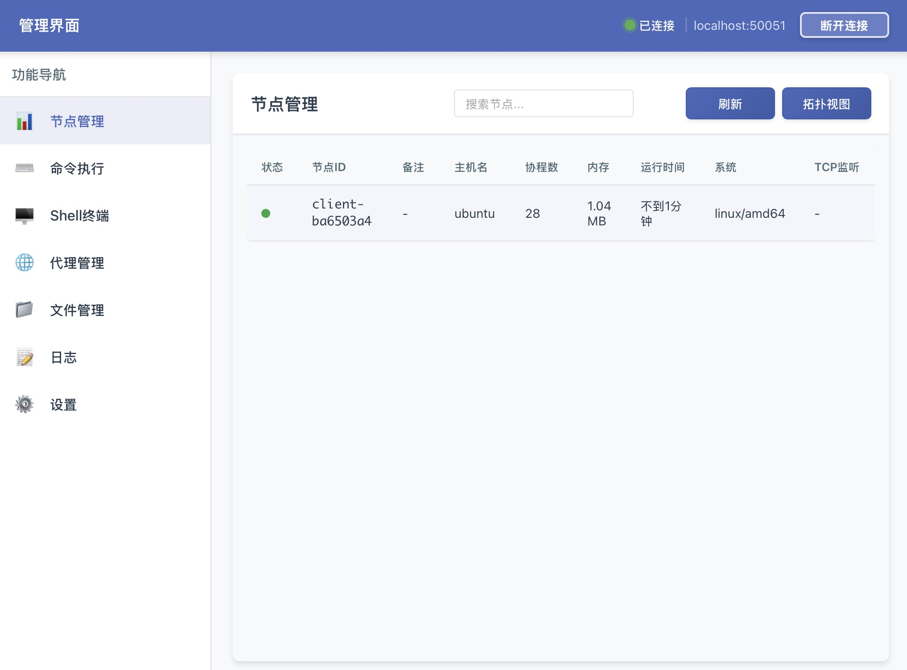

# GRPC-C

GRPC-C 是一个基于 gRPC 构建的纯go实现的分布式命令和控制框架，旨在实现安全的跨网络通信和命令执行，特别适用于有 NAT 和防火墙限制的网络环境。该项目提供了一个完整的生态系统，包含服务器、客户端和图形用户界面组件。

**为防止恶意使用，暂不开放源代码**



---

## ⚠️ 重要声明

**本项目专为网络安全学习、研究及合法渗透测试场景设计开发。**

在使用本工具之前，请您务必仔细阅读并充分理解以下条款：

### 合法使用规范

1. **授权要求**：使用本工具对任何系统进行测试前，必须事先获得该系统所有者的书面授权许可。未经授权的测试行为可能构成违法犯罪。

2. **适用场景**：本工具仅可用于：
   - 授权范围内的安全评估与渗透测试
   - 网络安全技术研究与学习
   - 企业内部合法的安全审计工作
   - 教育培训等合法教学活动

3. **禁止行为**：严禁将本工具用于任何未经授权的非法活动，包括但不限于：
   - 未授权访问他人计算机系统或网络
   - 窃取、破坏或篡改数据
   - 任何形式的网络攻击或破坏行为
   - 其他违反法律法规的行为

### 责任限制

1. **使用者责任**：使用本工具即代表您已完全理解并接受本声明。您需对使用本工具产生的一切后果承担全部责任，包括但不限于数据损失、系统故障、法律纠纷等。

2. **开发者免责**：本项目开发者及贡献者不对因使用、误用或滥用本工具而导致的任何直接或间接损失、损害承担责任，亦不对任何违法使用行为负责。

3. **法律合规**：使用者有义务确保自身行为符合所在地区的法律法规要求。不同国家和地区对网络安全工具的使用有不同的法律规定，请自行了解并遵守。

### 最终解释

- 本工具按"现状"提供，不提供任何明示或暗示的保证
- 开发者保留随时修改或终止本项目的权利
- 继续使用本工具即表示您已阅读、理解并同意遵守本声明的全部内容

**请理性使用，共同维护网络安全环境！**

---

## 项目架构

项目由三个组件组成，共同工作:

1. **服务器 (Server)** - 核心组件，负责管理所有客户端节点并处理来自管理器的请求
2. **客户端 (Client)** - 实现双进程架构，包含主进程和看门狗进程，以确保稳定性和隐蔽性
3. **图形用户界面 (GUI)** - 基于 Wails 和 Vue.js 构建的图形界面，便于管理 （mac版gui 请使用**xattr -rc grpc-c-gui.app**后打开）

## 主要功能

- **节点管理**：查看、管理所有连接的节点，支持节点备注功能便于识别
- **网络拓扑可视化**：直观展示节点之间的连接关系和网络结构
- **远程命令执行**：在远程节点上执行命令并获取结果
- **文件管理**：上传、下载、编辑远程节点上的文件，支持断点续传机制
- **交互式 Shell 终端**：提供交互式 Shell 会话功能
- **SOCKS5 代理管理**：创建和管理 SOCKS5 代理
- **节点状态监控**：实时查看节点的 CPU、内存使用率等状态信息
- **双进程架构**：客户端采用双进程架构确保稳定性和隐蔽性
- **多级转发上线**：支持节点多级转发上线机制，穿透复杂网络环境
- **自动重连**：连接失败时自动尝试备用服务器地址，提高连接成功率
- **跨平台支持**：支持 Windows, Linux, 和 macOS 平台
- **安全通信**：具备进程名称伪装和加密通信等安全特性

## 技术栈

- **后端**: Go (gRPC, Protobuf)
- **GUI**: Wails, Vue.js
- **Protobuf**: 用于服务定义
- **跨平台**: 支持 Windows, Linux, 和 macOS

## 协议定义

项目使用 Protocol Buffers 定义 gRPC 服务，提供了全面的消息集合：
- 节点注册和心跳
- 命令执行
- 文件操作（支持断点续传）
- Shell 会话
- 流量转发（支持多级转发）
- 节点拓扑和状态报告

## 安全特性

- Linux 上的进程名称伪装
- Linux 上的文件伪装至系统目录
- 双进程架构确保客户端韧性
- 加密通信
- 网络流量混淆以避免检测

## 构建和运行

### 先决条件
- Go 1.23 或更高版本
- Protocol Buffers 编译器 (protoc)
- Node.js 和 npm (用于 GUI)
- Wails (用于 GUI)

### 组件

#### 服务器 (Server)
```bash
./grpc-c-server [-listen address:port] [-password password] [-logfile log_file_path]
```
- `-listen`: 监听地址和端口，默认: `0.0.0.0:50051`
- `-password`: 管理端连接密码，留空默认密码为 `mastqiu01`
- `-logfile`: 日志文件路径，留空默认写入 `logs/server.log` 文件

#### 客户端 (Client)
```bash
./grpc-c-client [-server address:port] [-remote encrypted_url]
```

**命令行参数说明:**
- `-server`: 服务器地址 (例如: `localhost:50051`)，明文传入
- `-remote`: 加密的远程服务器地址获取URL，需要使用encrypt工具加密

**客户端特性:**
- 实现双进程架构（主进程+看门狗进程），Linux 上具有进程名称伪装功能
- 具有守护进程实现自愈，进程崩溃自动重启
- 连接失败10次后，会从备用地址获取新服务器地址
- 支持多实例同时运行（Linux通过随机socket名称隔离）

**使用加密工具:**

1. 使用encrypt工具加密备份服务器地址:
```bash
# 加密备份服务器地址，例如: 1.1.1.1:50051
./encrypt -data "1.1.1.1:50051"
# 输出: 加密：XXX123ABC...
# 将加密后的内容写入一个文本文件，例如: abc.txt
```

1. 将加密后的备份服务器地址放在Web服务器上:
```bash
# 将包含加密内容的文件托管在Web服务器
# 例如: http://127.0.0.1:8000/abc.txt
```

1. 加密远程URL地址:
```bash
# 加密完整的URL地址
./encrypt -data "http://127.0.0.1:8000/abc.txt"
# 输出: 加密：YYY456DEF...
```

1. 启动客户端并传入加密的remote参数:
```bash
# Linux
./grpc-c-client -server localhost:50051 -remote "YYY456DEF..."

# Windows
grpc-c-client.exe -server localhost:50051 -remote "YYY456DEF..."
```

**工作流程:**
1. 客户端启动时使用 `-server` 参数指定的主服务器地址连接
2. 如果主服务器连接失败10次，客户端会:
   - 自动解密 `-remote` 参数得到URL（例如: `http://127.0.0.1:8000/abc.txt`）
   - 从该URL下载内容并解密，得到备份服务器地址（例如: `1.1.1.1:50051`）
   - 使用备份服务器地址重新连接
3. 如果没有提供 `-remote` 参数，此参数无效。


#### 管理器图形用户界面 (Manager GUI)
管理器提供交互式界面来控制节点网络，在 GUI 中直接操作。
GUI 应用程序基于 Wails 构建，为所有功能提供可视化界面。

## 使用方法

### 连接服务器

1. 启动 GRPC-C GUI 应用
2. 在连接设置中输入 GRPC-C 服务器地址（例如：`localhost:50051`）
3. 输入密码，点击"连接"按钮

### 节点管理

- 在左侧导航栏选择"节点管理"查看所有连接的节点
- 点击节点可查看详细信息和执行操作
- 使用"拓扑视图"按钮查看节点网络拓扑结构，仅支持显示三级节点
- 可为节点添加备注便于管理

### 执行命令

1. 在节点列表中选择目标节点
2. 切换到"命令执行"标签页
3. 输入要执行的命令
4. 设置环境变量（可选）
5. 点击"执行"按钮

### 文件管理

1. 在节点列表中选择目标节点
2. 切换到"文件管理"标签页
3. 浏览远程文件系统
4. 使用工具栏按钮上传、下载、删除或编辑文件
5. 大文件传输支持断点续传，即使传输过程中断也能从断点继续

### 节点多级转发

1. 在复杂网络环境中，节点可通过其他在线节点进行多级转发连接
2. 服务器会自动识别并建立转发路径
3. 支持动态路径调整以确保连接稳定性

### Shell 终端

1. 在节点列表中选择目标节点
2. 点击"打开终端"按钮
3. 在终端中输入命令与远程节点交互

### 代理管理

1. 切换到"代理管理"标签页
2. 点击"新建代理"按钮
3. 选择节点和本地监听地址
4. 点击"启动"按钮创建 SOCKS5 代理

## 日志

- 服务器日志默认写入 `logs/server.log`


