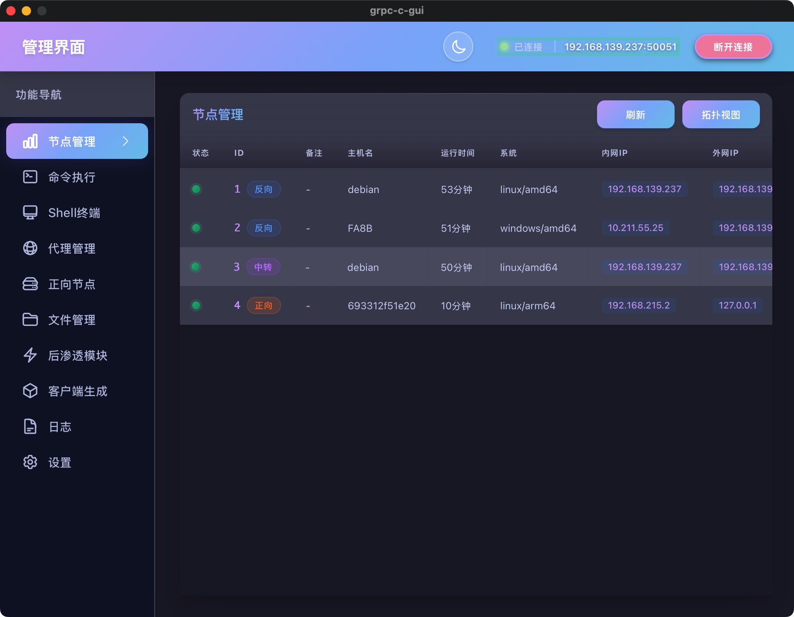

# GRPC-C 分布式远程控制与后渗透管理框架

GRPC-C 是一个基于 gRPC 的分布式多级远程控制与后渗透任务管理系统。采用纯 Go 语言实现，专为合法红蓝对抗、网络安全研究及授权渗透测试设计。本框架支持跨平台部署、多级内网穿透转发、自适应免杀混淆以及多端即时通知。

---

## 版本信息
**当前版本**: 1.0.8


---

## 💡 本次更新内容
1.  **桌面监控 (Desktop Monitor)**：新增实时桌面屏幕监控，支持高频画面捕捉与全屏预览（仅支持 Windows 节点）。
2.  **正向节点 (Forward Node)**：支持通过 JSP/JSPX 代理网关实现对无出网权限主机的穿透与反向级联控制。
3.  **提权组件增强**：武器库集成多个高价值提权组件，支持自定义模块快速集成与表单渲染。
4.  **Windows 完美无痕自毁**：
    *   引入由 Jonas Lyk 提出并在现代 EDR 对抗中极为有效的自毁方案（ADS Rename + POSIX Delete Pending）。
    *   在原进程执行过程中直接剥离主数据流（脱壳），同时免疫初次 EDR 扫描导致的 Sharing Violation 文件锁。
    *   提供包含针对极端魔改系统二次后备直接 `DeleteFile` 策略的完整双后备保护，覆盖现代（Go 1.24）与旧版 Legacy（Go 1.20）客户端，实现 100% 退出的同时无残留抹除。
5.  **GUI 优化**：
    *   节点管理支持“中转”标签智能识别与紫色样式标记。
    *   自定义 HTTP Headers 优化为多行文本框输入。
    *   修复节点列表多层级子节点递归显示及详情查看 Bug。
    *   优化节点管理页面多列表格（如长时间运行时的运行时间列、极长主机名列、架构系统信息列等）不换行显示，解决极长内容下的挤压多行乱码问题。

---

## 重要声明与安全守则

> [!IMPORTANT]
> **本项目仅供合法的安全测试、企业内部审计及学术研究使用。**
> 
> 在任何非授权的目标系统上部署或运行本软件均属违法行为。使用本工具前，您必须确保已获得目标系统的书面授权许可。使用者因违反法律法规而产生的一切后果由使用者自行承担，开发者不承担任何直接或间接的法律责任。

---

## 目录
- [GRPC-C 分布式远程控制与后渗透管理框架](#grpc-c-分布式远程控制与后渗透管理框架)
  - [版本信息](#版本信息)
  - [](#)
  - [💡 本次更新内容](#-本次更新内容)
  - [重要声明与安全守则](#重要声明与安全守则)
  - [目录](#目录)
  - [一、 部署与快速连接](#一-部署与快速连接)
    - [1. 部署服务端](#1-部署服务端)
    - [2. 连接管理端](#2-连接管理端)
  - [二、 GUI 主页面功能与使用方法](#二-gui-主页面功能与使用方法)
    - [1. 节点管理 (NodeManager)](#1-节点管理-nodemanager)
    - [2. 命令执行 (CommandTerminal)](#2-命令执行-commandterminal)
    - [3. 文件管理 (FileManager)](#3-文件管理-filemanager)
    - [4. 代理设置 (ProxyManager)](#4-代理设置-proxymanager)
    - [5. 正向节点 (ForwardNode)](#5-正向节点-forwardnode)
    - [6. 客户端生成器 (ClientGenerator)](#6-客户端生成器-clientgenerator)
    - [7. 后渗透 (PostExploit)](#7-后渗透-postexploit)
    - [8. 全局设置 (Settings)](#8-全局设置-settings)
  - [三、 核心注意事项与排错防翻车指南](#三-核心注意事项与排错防翻车指南)
    - [1. 备用服务端地址加密要求](#1-备用服务端地址加密要求)
    - [2. SGN 多态编码器平台与迭代硬限制](#2-sgn-多态编码器平台与迭代硬限制)
    - [3. 武器库占位符 `{MODULE_PATH}` 的使用限制](#3-武器库占位符-module_path-的使用限制)
    - [4. Linux 客户端与内存执行要求](#4-linux-客户端与内存执行要求)
    - [5. 任务沙箱（Windows Sandbox）清理规则](#5-任务沙箱windows-sandbox清理规则)
    - [6. 网络端口与云服务器配置](#6-网络端口与云服务器配置)

---

## 一、 部署与快速连接

本框架采用 服务端 - 管理端（GUI） - 被控客户端 的分离式架构。

### 1. 部署服务端
将编译好的服务端 `grpc-c-server` 上传至拥有公网 IP 的 Linux 服务器中，以命令行方式启动：
```bash
./grpc-c-server -l 0.0.0.0:50051 -pwd 控制端连接密码 -dport 50052 -log logs/server.log
```
* **参数说明**：
  * `-l`：gRPC 监听地址及端口，控制端与被控端将通过此端口通信。
  * `-pwd`：管理端登录所需的验证密码，默认密码 `masterqiu01` 。
  * `-dport`：分发/下载服务的 HTTPS 端口（用于 Loader 下载、一次性 URL 下载等）。
  * `-log`：服务端日志保存路径。

### 2. 连接管理端
1. 运行 `grpc-c-gui` 图形管理端。
2. 在服务器地址栏输入：`公网IP:50051`，并输入上面配置的密码。
3. 点击“连接”进入主界面。

---

## 二、 GUI 主页面功能与使用方法

### 1. 节点管理 (NodeManager)
节点管理页面是框架的默认主页，提供所有在线主机的集中管理和网络拓扑可视化展示。
* **主要功能**：
  * **实时列表与状态监控**：实时展示所有在线被控端的内存占用率、上线时间、操作系统与架构、Goroutine 数量及出网/内网 IP 等。
  * **节点中转标记 (新增)**：新增识别逻辑，通过父节点级联上线的子节点将自动标记为“中转”标签并赋予专属紫色样式，清晰区分直连与中转节点。
  * **节点备注**：支持在列表中右键选择节点并添加自定义备注，方便在复杂内网环境中快速研判资产。
  * **可视化拓扑图**：动态构建多级级联节点的父子级网络中转映射关系，清晰展示控制流链路的纵深传递路径。
  * **递归视图修复 (优化)**：修复了节点列表多层级子节点无法被检索和展示的 Bug，确保嵌套节点数据完整。
  * **桌面监控入口 (新增)**：支持在节点右键菜单中开启 Windows 节点的实时桌面监控功能。
* **使用方法**：
  * 连接服务端成功后，自动加载节点列表和拓扑图。
  * 在节点行上右键，可弹出快捷操作菜单，进行命令执行、文件管理、交互终端、代理穿透、连接重置、桌面监控或执行下线等操作。

### 2. 命令执行 (CommandTerminal)
用于向被控端批量下发单次系统指令。
* **主要功能**：
  * **快速命令下发**：提供命令输入框和超时时间（Timeout）设置，支持输入环境变量（ENV）。
  * **命令执行历史**：自动记录您执行过的命令历史，方便快速重复调用。
  * **命令任务列表管理**：支持异步查看历史输出或一键强制停止未执行完毕的超时挂起命令。
* **使用方法**：
  * 选择目标节点 -> 输入执行命令（如 `whoami`） -> 设定超时（输入 0表示不超时） -> 点击“执行命令”。
  * 结果将在下方区域以流式形式实时回显。

### 3. 文件管理 (FileManager)
提供被控端本地文件系统的图形化全生命周期操作面板。
* **主要功能**：
  * **文件与目录操作**：支持目录双击浏览、创建新目录、重命名文件/目录、获取详细文件属性（Stat）以及删除文件。
  * **高性能上传与下载**：基于分块流（Chunk）技术，支持管理端与被控端之间大文件的高速传输。
  * **流式断点续传**：支持自动从断点（Offset）处继续传输。
  * **在线文本编辑**：双击任意文本文件即可在线直接修改代码或配置文件。

### 4. 代理设置 (ProxyManager)
实现多级内网流量的穿透代理与端口中转。
* **主要功能**：
  * **流量转发 (SOCKS5 代理)**：在指定被控节点上开启 SOCKS5 代理服务，将外部管理机流量打包直接打入目标主机局域网。
  * **转发监听 (正向端口转发)**：在被控节点本地监听指定端口，实现多级内网机器穿透上线。
  * **多监听器支持 (优化)**：支持在正向节点上同时维护系统级控制网关（如 9527）与多个用户自定义转发监听端口（如 10080），并提供系统保护机制。
* **使用方法**：
  * **流量转发**：选择节点 -> 输入本地管理机要开放的监听地址与端口（如 `127.0.0.1:1080`） -> 点击“启动代理”。
  * **转发监听**：选择中继节点 -> 输入要开启的端口（如 `0.0.0.0:10080`） -> 点击“启动监听”。

### 5. 正向节点 (ForwardNode)
用于通过 Web 漏洞或已知凭据，对无出网权限的内网主机进行全自动正向客户端注入、部署与 SMUX 控制隧道桥接上线。
* **主要功能**：
  * **正向节点环境探测**：远程请求目标 JSP/JSPX 代理网关，验证环境信息。
  * **一键自动部署**：根据探测出的架构，自动部署正向客户端二进制文件并隐蔽运行。
  * **控制隧道桥接 (Connect)**：基于单次轮询长连接建立高隐蔽性 HTTP 隧道，自动将流量导入服务端 gRPC 引擎。
  * **自定义 Header 输入 (优化)**：支持多行文本框设计，支持一键批量粘贴多个自定义 HTTP Header，便于伪造流量规避 WAF。
  * **正向代理模板导出**：提供自定义 XOR 混淆密钥，一键导出防杀免杀的 JSP/JSPX 桥接代理源代码。
* **使用方法**：
  * 输入目标 JSP 网关 URL 及通信 XOR 秘钥。
  * 配置自定义 Header 后，点击“部署并连接”。

### 6. 客户端生成器 (ClientGenerator)
用于免编译一键配置生成被控端木马和轻量启动器。
* **主要功能**：
  * **三种客户端形态生成**：完整客户端、轻量 Loader、Shellcode。
  * **Shikata Ga Nai (SGN) 多态编码器**：支持一键开启 SGN 编码，实现强力免杀。
  * **一次性安装 URL**：生成一次性阅后即焚式下载链接，防御溯源。

### 7. 后渗透 (PostExploit)
提供图形化载荷下发功能，是框架武器库的运行面板。
* **主要功能**：
  * **新增高价值提权组件 (新增)**：集成包括 `Potato` 系列、Sysinfo 等在内的多个高价值模块，实现快速提权与敏感资产获取。
  * **武器库模块列表加载**：服务端 `data/modules/` 下的所有自定义 YAML 模块会被自动刷新并解析。
  * **参数表单动态渲染**：双击选择武器模块后，页面会自动根据模块定义的参数变量渲染出输入表单。
  * **高度可扩展开发**：支持用户高度自主定制开发，详见 `GUIDE.md` 模块开发指南。
* **使用方法**：
  * 双击选择目标主机 -> 导航栏选择后渗透 -> 选择武器模块 -> 填写表单 -> 点击“执行模块”。

### 8. 全局设置 (Settings)
用于配置框架的全局即时通知告警服务。
* **主要功能**：
  * **Webhook 三端联动**：集成钉钉、飞书、蓝信推送，支持 HMAC-SHA256 安全加签校验。
* **使用方法**：
  * 填入机器人的 Webhook 地址及对应的加签 Secret -> 点击“发送测试消息”验证连接 -> 验证无误后点击“保存”。

---

## 三、 核心注意事项与排错防翻车指南

> [!WARNING]
> **请在部署和实战前，仔细阅读以下技术边界限制，避免导致任务异常或上线失败。**

### 1. 备用服务端地址加密要求
* **必须使用专属加密工具**：
  当您在“客户端生成器”或模块配置中设定 **“备用服务器地址”** 时，出于流量免杀和防静态提取的目的，该地址**必须事先使用专用的加密工具进行加密**。
* **使用方法示例**：
  1. 在命令行中运行：`./grpc-c-encrypt-linux-amd64 -data "1.1.1.1:50051"`。
  2. 假设输出的密文字符串为：`k2h3g4j5k6l7...`。
  3. 将该密文字符串直接存入一个文本文件（如 `1.txt`）并上传至可通过 HTTP 访问的位置。
  4. 在配置中填入该文件的 URL，例如：`https://a.b.c/1.txt`。
  客户端连接主服务端失败后，会通过 HTTPS GET 请求该 URL，获取密文并在本地内存中解密后连接备用服务器。

### 2. SGN 多态编码器平台与迭代硬限制
* **仅限 Linux 服务端可用**：该功能强依赖底层 Linux 环境，部署在 Windows/macOS 下会自动降级，不予报错。

### 3. 武器库占位符 `{MODULE_PATH}` 的使用限制
* **严禁在 Linux 或纯命令行任务（`CMD_EXEC`）中使用 `{MODULE_PATH}`**：该占位符仅适用于 Windows 沙箱机制，在其他环境强行使用将导致占位符无法解析从而执行失败。

### 4. Linux 客户端与内存执行要求
* **内存执行载荷必须使用静态编译**：Linux 下的无文件内存执行要求写入载荷必须在编译时加入 `-static` 参数以避免加载失败。

### 5. 任务沙箱（Windows Sandbox）清理规则
* **自动清理机制**：Windows 的任务运行结束后会开启后台线程进行最多 10 次的循环删除尝试，确保无落地残留。请避免在武器中启动无法正常退出的后台死锁进程。

### 6. 网络端口与云服务器配置
* 服务端部署在云服务器上时，**必须同时放行安全组中的 gRPC 端口（默认 50051）与 HTTP 文件分发端口（默认 50052）**。
